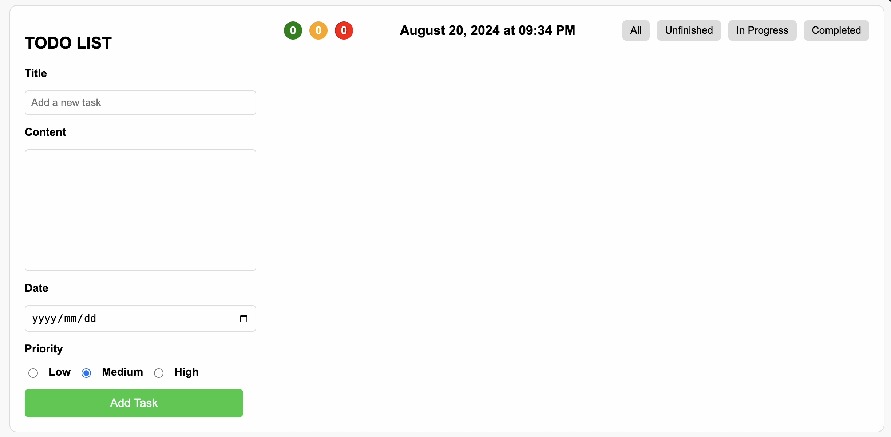
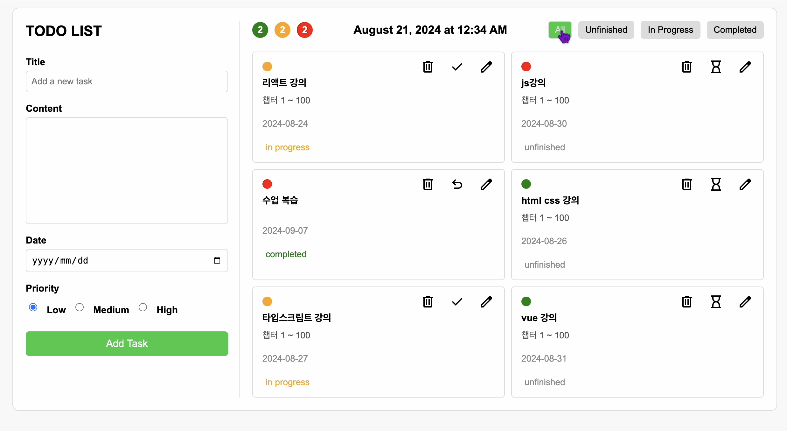

## To-do list 프로젝트 개요  

### ▶️ 프로젝트 기획 동기

이 프로젝트는 일상 생활에서 해야 할 일을 효율적으로 관리하고 우선순위를 설정할 수 있는 간단한 도구를 찾는 것에서 시작되었습니다. 사용자가 직관적으로 할 일을 추가하고, 우선순위를 설정하며 날짜를 지정할 수 있도록 설계되었습니다.

### ▶️ 프로젝트 기획 과정

팀원들과 함께 어떤 기능을 구현할지, 그리고 디자인 방향에 대해 의논하면서 프로젝트를 시작했습니다. 각자의 역할을 맡아 기획을 진행했고 개인적으로 기능을 구현하는 동안에도 우리는 꾸준히 소통하며 서로의 진행 상황을 공유하고 협력했습니다. 

### ▶️ 프로젝트 특징

많은 할 일 관리 앱들이 복잡한 인터페이스를 가지고 있어 오히려 사용자에게 부담을 주는 경우가 있는데, 이 To-Do List는 간단하면서도 핵심 기능에 충실하여 사용자가 작업에 집중할 수 있도록 돕습니다.

### ▶️ 주요 기능 특징

- 사용자가 쉽게 이해하고 사용할 수 있는 인터페이스를 제공
- 할 일 추가, 삭제 및 메모 입력 가능
- 할 일 수정 시 모달 창을 통해 사용자가 쉽게 작업을 수정
- 날짜와 우선순위 설정 가능
- 할 일을 우선순위별로 필터링하여 가장 중요한 작업을 우선적으로 확인 가능
- **상태 변경 기능**: 작업의 상태를 '완료', '진행 중', '미완료'로 변경
- **상태 기반 정렬**: 작업들을 상태별로 정렬하여 작업의 진행 상황 관리 용이
- 실시간으로 현재 시간 표시
